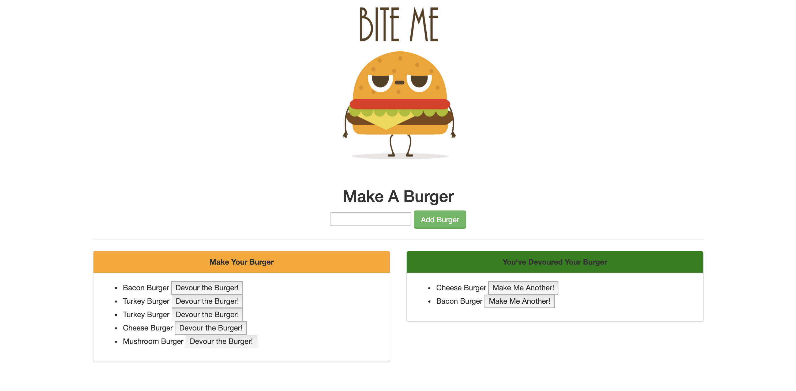

# Burger App
This is an application that will log the desired burgers created and give you the option to devour them.  

### Technologies Used
MYSQL, Node, Express, Handlebars, and ORM.  

Following the MVC pattern, Node and MYSQL are used to query and route the data in the application, and Handlebars is used to populate the HTML for the application. 

**Demo:**
This application is deployed through Heroku.  Click to check out [here](https://agile-taiga-36001.herokuapp.com/).
